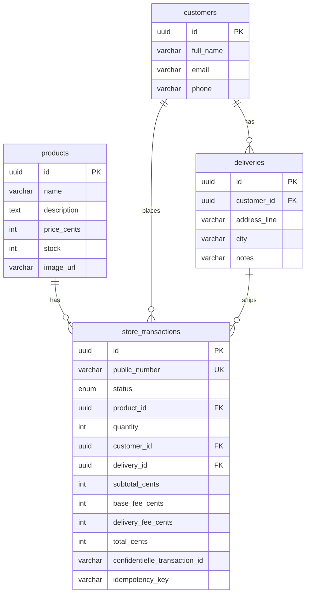

# Monorepo checkout sandbox

SPA en **React + Redux Toolkit** y API en **NestJS + TypeScript + PostgreSQL**, con integración a **sandbox** de pagos con tarjeta (token en el navegador, cobro en servidor), arquitectura **hexagonal** (puertos y adaptadores), resultados tipo **ROP** en casos de uso, y pruebas con **Jest**.

> Convocatoria: el nombre del repositorio público no debe incluir la marca del proveedor de pagos indicada en la prueba.

## Enlaces de despliegue (sustituir tras publicar)

| Entorno | URL |
|--------|-----|
| Frontend | `https://TU-DOMINIO-FRONT` |
| API | `https://TU-DOMINIO-API` |
| OpenAPI (Swagger) | `https://TU-DOMINIO-API/docs` |

## Documentación de API

- Swagger UI en la API: ruta `/docs` (ver `apps/api/src/main.ts`).
- Colección Postman: [postman/checkout-sandbox.postman_collection.json](postman/checkout-sandbox.postman_collection.json).

## Modelo de datos



- Montos en **centavos COP** alineados al campo `amount_in_cents` del proveedor.
- No se persisten PAN/CVV; solo el **token** generado en el cliente.

## Requisitos

- Node.js 20+
- **PostgreSQL** accesible en `localhost:5432` (elige una de las dos formas siguientes).

## Variables de entorno

Copia la raíz [`.env.example`](.env.example) a `.env` y ajusta. Para la web, copia [`apps/web/.env.example`](apps/web/.env.example) a `apps/web/.env`.

- **API**: si `confidentielle_PRIVATE_KEY` está vacío o `confidentielle_MOCK=true`, el cobro usa un adaptador **mock** (útil en CI y desarrollo sin llaves).
- **Web**: con `VITE_confidentielle_MOCK=true` se omite la tokenización HTTP y se envía un token ficticio compatible con el mock del servidor.

## Cómo ejecutar en local

### 1. Dependencias y entorno

Desde la raíz del monorepo:

```bash
npm install
cp .env.example .env
cp apps/web/.env.example apps/web/.env
```

### 2. Base de datos

**Opción A — Docker** (coincide con [docker-compose.yml](docker-compose.yml) y el `.env.example`):

```bash
docker compose up -d
```

**Opción B — PostgreSQL con Homebrew (macOS)** si no usas Docker:

```bash
brew install postgresql@16
brew services start postgresql@16
```

Crea usuario y base con los mismos valores que en `.env.example` (`checkout` / `checkout` / `checkout_db`):

```bash
export PATH="/opt/homebrew/opt/postgresql@16/bin:$PATH"
psql -d postgres -c "CREATE USER checkout WITH PASSWORD 'checkout';" \
  -c "CREATE DATABASE checkout_db OWNER checkout;" \
  -c "GRANT ALL PRIVILEGES ON DATABASE checkout_db TO checkout;"
```

(Si el rol o la base ya existen, Postgres devolverá error; en ese caso puedes ignorarlo o ajustar solo lo que falte.)

No ejecutes a la vez **Docker** y **Homebrew** en el puerto `5432`: usa solo uno.

### 3. API y web (dos terminales)

Terminal 1 — API:

```bash
npm run api:dev
```

- `DATABASE_SYNC=true` (por defecto en el ejemplo) crea/actualiza tablas en desarrollo.
- Swagger: `http://localhost:3000/docs`

Terminal 2 — frontend:

```bash
npm run web:dev
```

Abre `http://localhost:5173`. La API queda en `http://localhost:3000`.

### Detener procesos

```bash
pkill -f "nest start"    # API
pkill -f "vite"        # Vite (web)
```

Con Homebrew, si quieres apagar Postgres del sistema: `brew services stop postgresql@16`.

## Solución de problemas (local)

- **`Cannot find module '@nestjs/schematics'`** al arrancar la API: en el monorepo ya está declarado `@nestjs/schematics`; ejecuta `npm install` en la raíz. El archivo [apps/api/nest-cli.json](apps/api/nest-cli.json) debe usar `"collection": "@nestjs/schematics"` (no la ruta al `collection.json`).
- **`ECONNREFUSED` a PostgreSQL**: comprueba que el contenedor Docker esté arriba (`docker compose ps`) o que `brew services` tenga `postgresql@16` en marcha, y que host/puerto/usuario/clave en `.env` coincidan.

## Flujo funcional (5 pasos)

1. Catálogo con stock y precio.
2. Modal «Pagar con tarjeta»: validación de tarjeta (Luhn), detección **Visa/Mastercard**, datos de envío; crea transacción **PENDING** en la API.
3. **Backdrop** de resumen (subtotal, tarifa base fija, envío) y botón **Pagar ahora** (tokenización + `POST /transactions/:id/pay`).
4. Pantalla de resultado (aprobado / declinado / error).
5. Vuelta al catálogo con stock actualizado.

Tras un **refresh** con transacción `PENDING` guardada, la app rehidrata el paso de resumen vía `GET /transactions/:id` (los datos de tarjeta deben introducirse de nuevo; no se guardan en `localStorage`).

## Pruebas y cobertura

```bash
npm run api:test
npm run web:test
```

Los informes se generan en `apps/api/coverage` y `apps/web/coverage`. El objetivo de la prueba es **>80%** en front y back; los porcentajes exactos dependen del entorno local tras ejecutar los comandos anteriores.

## Despliegue sugerido

- **API**: Railway, Render, Fly.io o AWS (ECS/Fargate, Lambda + API Gateway). PostgreSQL administrado (RDS, Neon, Supabase).
- **Frontend**: Vercel, Netlify, S3 + CloudFront.
- Configura `CORS_ORIGIN` en la API con el dominio del front y `VITE_API_URL` en el build del front con la URL pública de la API (HTTPS).

## Estructura

- `apps/api` — NestJS, capas dominio / aplicación / infraestructura / presentación.
- `apps/web` — Vite + React + Redux Toolkit.
- `postman/` — colección HTTP.

## CI

GitHub Actions (`.github/workflows/ci.yml`) instala dependencias y ejecuta tests con cobertura en API y web.
